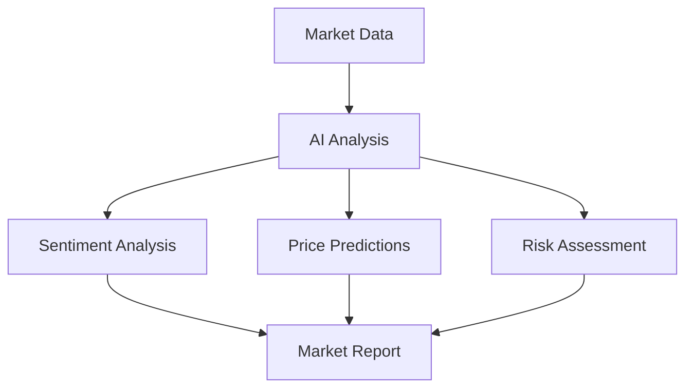
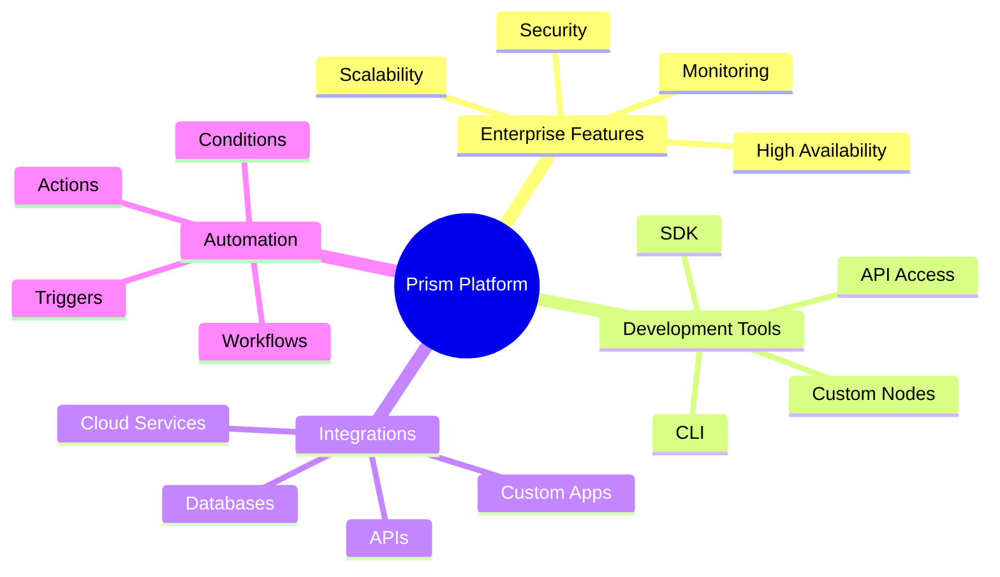
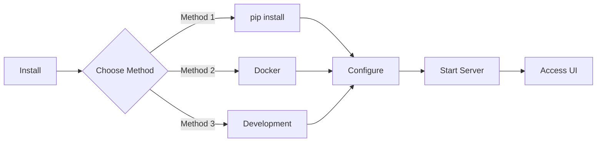
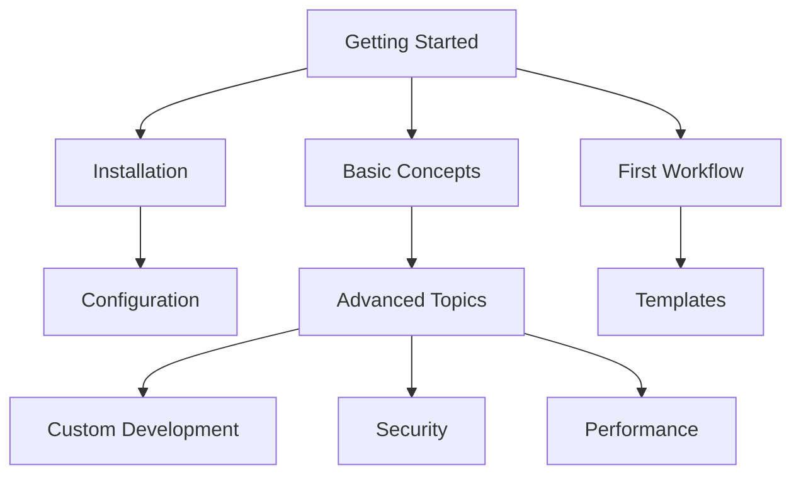

<div align="center">
  <a href="https://prism.io">
    
  </a>
</div>

<p align="center">
  <em>The Enterprise-Grade Production-Ready Workflow Automation Platform for Modern Teams</em>
</p>

<p align="center">
    <a href="#">
        
        
    </a>
</p>

<p align="center">
<a href="https://twitter.com/prism_terminal/">🐦 Twitter</a>
<span>&nbsp;&nbsp;•&nbsp;&nbsp;</span>
<a href="https://prism.fun/">Prism Platform</a>
</p>


[](https://github.com/prism-terminal/prism/issues)
[]()
[]()
[]()
[]()
[]()

[]()
[]()
[]()

## 🎯 Overview

Prism is a powerful workflow automation platform designed for modern enterprises. It combines the flexibility of code with the simplicity of no-code solutions, enabling teams to build, deploy, and scale automation workflows efficiently.

## 🤖 Crypto Data Collector with AI

The Crypto Data Collector is an advanced cryptocurrency analysis tool that combines traditional technical analysis with AI-powered insights. Located in the `py/crypto_collector` directory, it provides real-time market data collection, analysis, and AI-driven predictions.

### Key Features

| Category | Features | Description |
|----------|----------|-------------|
| 📊 Data Collection | • Real-time Price Data<br>• Market Capitalization<br>• Trading Volume<br>• Historical Data | Collects comprehensive market data every 5 minutes |
| 📈 Technical Analysis | • RSI Indicator<br>• MACD Analysis<br>• Bollinger Bands<br>• Moving Averages | Calculates key technical indicators for trading |
| 🤖 AI Analysis | • Market Sentiment<br>• Price Predictions<br>• Risk Assessment<br>• Trading Signals | Uses GPT-4 for advanced market analysis |
| ⚡ Real-time Alerts | • Price Changes<br>• Volume Spikes<br>• Pattern Recognition<br>• Email Notifications | Instant alerts for significant market movements |
| 📁 Data Export | • CSV Format<br>• JSON Format<br>• Excel Sheets<br>• Automated Reports | Flexible data export options |

### AI Capabilities



#### AI-Powered Features:
- **Market Sentiment Analysis**: Advanced sentiment analysis using GPT-4
- **Price Movement Predictions**: 24-hour price direction forecasting
- **Risk Assessment**: Comprehensive risk evaluation
- **Trading Recommendations**: AI-generated trading signals
- **Market Reports**: Detailed market analysis reports

### Project Structure
```bash
py/crypto_collector/
├── analyzers/           # Analysis modules
│   ├── market_analyzer.py   # Technical analysis
│   └── ai_analyzer.py       # AI-powered analysis
├── collectors/         # Data collection
│   ├── price_collector.py
│   ├── market_collector.py
│   └── info_collector.py
├── database/          # Data storage
│   └── db_handler.py
├── alerts/            # Alert system
│   └── alert_system.py
├── exporters/         # Data export
│   └── data_exporter.py
├── config/            # Configuration
│   └── settings.py
└── main.py            # Main entry point
```

### Setup & Configuration

1. **Environment Setup**:
```bash
# Create virtual environment
python -m venv venv
source venv/bin/activate

# Install dependencies
pip install -r requirements.txt
```

2. **Configuration**:
```env
# .env file
OPENAI_API_KEY=your_api_key
CRYPTO_API_KEY=your_crypto_api_key
DB_HOST=localhost
DB_PORT=27017
```

3. **Running the Collector**:
```bash
python py/crypto_collector/main.py
```

### Data Analysis Output

The system generates various outputs:
- Technical analysis indicators
- AI-generated market insights
- Price predictions
- Risk assessments
- Trading signals

### Integration with OpenAI

The project leverages OpenAI's GPT-4 for:
- Market sentiment analysis
- Price movement predictions
- Trading recommendations
- Risk evaluation
- Comprehensive market reports

### Monitoring & Alerts

- Real-time price movement alerts
- Volume spike notifications
- Technical indicator signals
- AI-generated trading opportunities
- Email notifications for significant events

## 📁 Project Structure

```bash
prism/
├── packages/                  # Core packages directory
│   ├── cli/                  # Command line interface
│   │   ├── bin/             # Executable files
│   │   └── src/             # CLI source code
│   ├── core/                # Core functionality
│   │   ├── src/             # Core source code
│   │   └── test/            # Core tests
│   ├── nodes-base/          # Base nodes
│   │   ├── nodes/           # Node implementations
│   │   └── credentials/     # Credential definitions
│   ├── design-system/       # UI components
│   ├── editor-ui/           # Frontend editor
│   └── workflow/            # Workflow engine
├── docker/                  # Docker configurations
│   ├── images/             # Docker images
│   └── compose/            # Docker compose files
├── docs/                    # Documentation
├── scripts/                 # Utility scripts
└── tests/                   # End-to-end tests
```

### Key Directories

| Directory | Description |
|-----------|-------------|
| `packages/cli` | Command line interface for Prism |
| `packages/core` | Core functionality and business logic |
| `packages/nodes-base` | Standard node implementations |
| `packages/design-system` | Reusable UI components |
| `packages/editor-ui` | Web-based workflow editor |
| `packages/workflow` | Workflow execution engine |
| `docker` | Container configurations |
| `docs` | Project documentation |
| `scripts` | Development and maintenance scripts |
| `tests` | Automated test suites |

Prism is a powerful workflow automation platform designed for modern enterprises. It combines the flexibility of code with the simplicity of no-code solutions, enabling teams to build, deploy, and scale automation workflows efficiently.

### Why Choose Prism?

- **Powerful Automation**: Build complex workflows with our visual editor or code them directly
- **Enterprise Ready**: Production-grade infrastructure with high availability and security
- **Flexible Integration**: Connect with 400+ systems and services out of the box
- **AI-Powered**: Leverage built-in AI capabilities for intelligent automation
- **Developer Friendly**: Full API access, custom node support, and extensive documentation

### Perfect For:

- **Enterprise Teams**: Streamline operations and automate business processes
- **Developers**: Build and deploy custom integrations and workflows
- **Data Teams**: Create robust data pipelines and automation
- **DevOps**: Automate deployment and infrastructure management

### Key Differentiators:

- **Production Ready**: Built for reliability and performance at scale
- **Self-Hosted Option**: Keep your data and workflows under your control
- **Fair-Code License**: Transparent source code with flexible licensing
- **Active Community**: Large ecosystem of plugins and templates
- **Enterprise Support**: Professional support and custom development available

## ✨ Features



| Category | Features | Benefits |
|----------|----------|-----------|
| 🏢 Enterprise Architecture | • Production-Ready Infrastructure<br>• High Reliability Systems<br>• Modular Design<br>• Comprehensive Logging | • Reduced downtime<br>• Easier maintenance<br>• Better debugging<br>• Enhanced monitoring |
| 🔄 Integration Capabilities | • Multi-Model Support<br>• Custom Node Creation<br>• Extensive Tool Library<br>• Multiple Memory Systems | • Provider flexibility<br>• Custom solutions<br>• Extended functionality<br>• Enhanced memory management |
| 📈 Scalability | • Concurrent Processing<br>• Resource Management<br>• Load Balancing<br>• Horizontal Scaling | • Higher throughput<br>• Efficient resource use<br>• Better performance<br>• Easy scaling |
| 🛠️ Developer Tools | • Simple API<br>• Extensive Documentation<br>• Active Community<br>• CLI Tools | • Faster development<br>• Easy learning curve<br>• Community support<br>• Quick deployment |
| 🔐 Security Features | • Error Handling<br>• Rate Limiting<br>• Monitoring Integration<br>• Audit Logging | • Improved reliability<br>• API protection<br>• Better monitoring<br>• Enhanced tracking |

### Key Capabilities

- **Code When You Need It**: Write JavaScript/Python, add npm packages, or use the visual interface
- **AI-Native Platform**: Build AI agent workflows with your own data and models
- **Full Control**: Self-host with our fair-code license or use our cloud offering
- **Enterprise-Ready**: Advanced permissions, SSO, and air-gapped deployments
- **Active Community**: 400+ integrations and ready-to-use templates

## 🚀 Requirements & Installation



### Requirements
- `python3.10` or above
- `.env` file with API keys from your providers
- Set workspace directory: `WORKSPACE_DIR="agent_workspace"`

### Installation Methods

#### 1. Using pip (Recommended)
```bash
pip install -U prism
```

#### 2. Using npx
```bash
npx prism
```

#### 3. Using Docker
```bash
docker run -it --rm --name prism -p 5678:5678 docker.prism.io/prism-io/prism
```

### Environment Setup

1. Create and configure your `.env` file:
```env
PRISM_BASIC_AUTH_ACTIVE=true
PRISM_PORT=5678
PRISM_PROTOCOL=http
WORKSPACE_DIR="agent_workspace"
```

2. Run the onboarding process:
```bash
prism onboarding
```

### System Requirements

| Component | Minimum | Recommended |
|-----------|---------|-------------|
| CPU | 2 cores | 4+ cores |
| RAM | 4GB | 8GB+ |
| Storage | 10GB | 20GB+ |
| OS | Linux/macOS/Windows | Linux/macOS |
| Python | 3.10+ | 3.11+ |

## 📚 Guides and Documentation




## 🌟 Community & Support

- 🐦 [Twitter Updates](https://twitter.com/prism_terminal)


## 🤝 Contributing

We welcome contributions! Here's how you can help:

- 🐛 Report bugs by [creating an issue](https://github.com/prism-terminal/prism/issues)
- 💡 Suggest features through [our forum]()
- 📖 Improve our [documentation]()
- 🔧 Submit pull requests (please read our [Contributing Guide]() first)

## 📄 License

Prism is released under [fair-code](https://prism.fun) licensing. See our [LICENSE.md]() for details.

## 🌟 Join Our Team

Want to shape the future of workflow automation? [Check our careers page]()!

## 🔧 Configuration

### Basic Configuration
```env
# Server Configuration
PRISM_HOST=0.0.0.0
PRISM_PORT=5678
PRISM_PROTOCOL=http

# Authentication
PRISM_BASIC_AUTH_ACTIVE=true
PRISM_BASIC_AUTH_USER=user
PRISM_BASIC_AUTH_PASS=pass

# Workspace
WORKSPACE_DIR=agent_workspace
```

### Advanced Settings
```env
# Performance Tuning
PRISM_EXECUTION_TIMEOUT=300
PRISM_QUEUE_BULL_REDIS_HOST=localhost
PRISM_QUEUE_BULL_REDIS_PORT=6379

# Logging
PRISM_LOG_LEVEL=info
PRISM_LOG_OUTPUT=console
```

## 🔄 Updates & Maintenance

### Updating Prism
```bash
# Using pip
pip install -U prism

# Using Docker
docker pull prism-io/prism:latest
```

### Backup Recommendations
- Regularly backup your workflows
- Export important configurations
- Keep environment variables secure

### Health Checks
```bash
# Check Prism status
prism status

# Verify installation
prism doctor
```

### Industry Use Cases

| Industry | Use Cases | Benefits |
|----------|-----------|----------|
| 🏢 Enterprise | • Workflow Automation<br>• Process Integration<br>• Data Pipeline Management | • Increased Efficiency<br>• Reduced Manual Work<br>• Better Compliance |
| 🏦 Finance | • Transaction Processing<br>• Risk Analysis<br>• Reporting Automation | • Faster Processing<br>• Better Accuracy<br>• Real-time Insights |
| 🏥 Healthcare | • Patient Data Management<br>• Care Coordination<br>• Compliance Tracking | • Improved Patient Care<br>• Reduced Errors<br>• Better Compliance |
| 🛍️ Retail | • Inventory Management<br>• Order Processing<br>• Customer Analytics | • Better Stock Control<br>• Faster Fulfillment<br>• Enhanced CX |

## 📥 Detailed Installation Guide

### Prerequisites

Before installing Prism, ensure you have:

1. **Python Environment**:
   ```bash
   # Check Python version (should be 3.10+)
   python --version

   # Create a virtual environment (recommended)
   python -m venv prism-env
   source prism-env/bin/activate  # Linux/macOS
   # or
   .\prism-env\Scripts\activate   # Windows
   ```

2. **System Dependencies**:
   ```bash
   # Ubuntu/Debian
   sudo apt-get update
   sudo apt-get install -y build-essential python3-dev

   # CentOS/RHEL
   sudo yum groupinstall -y "Development Tools"
   sudo yum install -y python3-devel

   # macOS (with Homebrew)
   brew install python@3.10
   ```

### Installation Options

#### 1. Pip Installation (Recommended)
```bash
# Install Prism
pip install -U prism

# Verify installation
prism --version

# Initialize workspace
prism init my-workspace
cd my-workspace
```

#### 2. Docker Installation
```bash
# Pull the latest image
docker pull docker.prism.io/prism-io/prism:latest

# Create a directory for persistence
mkdir prism-data

# Run with mounted volume
docker run -it --rm \
  --name prism \
  -p 5678:5678 \
  -v $(pwd)/prism-data:/home/node/.prism \
  docker.prism.io/prism-io/prism
```

#### 3. Development Setup
```bash
# Clone the repository
git clone https://github.com/prism-io/prism.git
cd prism

# Install dependencies
pip install -r requirements.txt

# Install in development mode
pip install -e .
```

### Post-Installation Setup

1. **Create Configuration File**:
   ```bash
   # Create .env.examples file
   cat > .env.examples << EOL
   PRISM_BASIC_AUTH_ACTIVE=true
   PRISM_PORT=5678
   PRISM_PROTOCOL=http
   WORKSPACE_DIR="agent_workspace"
   EOL
   ```

2. **Initialize Workspace**:
   ```bash
   # Create and setup workspace
   prism init-workspace

   # Verify setup
   prism doctor
   ```

3. **Start Prism**:
   ```bash
   # Start the server
   prism start

   # Or start with tunnel
   prism start --tunnel
   ```

### Troubleshooting Common Issues

1. **Port Conflicts**:
   ```bash
   # Check if port is in use
   lsof -i :5678

   # Use different port
   PRISM_PORT=5679 prism start
   ```

2. **Permission Issues**:
   ```bash
   # Fix workspace permissions
   sudo chown -R $(whoami) agent_workspace/
   ```

3. **Dependencies Issues**:
   ```bash
   # Reinstall dependencies
   pip install --force-reinstall prism
   ```

## 🔄 Project Structure

```bash
prism/
├── py/                      # Python package directory
│   ├── crypto_collector/    # Cryptocurrency data collection project
│   │   ├── __init__.py
│   │   ├── collectors/     # Data collectors
│   │   │   ├── __init__.py
│   │   │   ├── price_collector.py    # Price data collector
│   │   │   ├── market_collector.py   # Market cap collector
│   │   │   └── info_collector.py     # Coin information collector
│   │   ├── models/        # Data models
│   │   │   ├── __init__.py
│   │   │   └── crypto_data.py
│   │   ├── database/      # Database operations
│   │   │   ├── __init__.py
│   │   │   └── db_handler.py
│   │   ├── utils/         # Utility functions
│   │   │   ├── __init__.py
│   │   │   ├── api_client.py
│   │   │   └── time_utils.py
│   │   ├── config/        # Configuration files
│   │   │   ├── __init__.py
│   │   │   └── settings.py
│   │   └── main.py        # Main entry point
│   ├── examples/           # Example scripts
│   ├── tests/             # Python tests
│   ├── utils/             # Utility functions
│   └── core/              # Core Python modules
```
